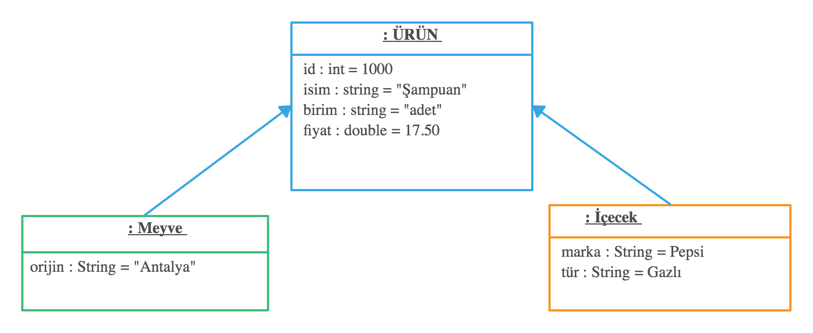

<b> Kalıtım – Lab Uygulaması <b>

Bir markette yer alan her türlü ürünü temsil etmek üzere “ÜRÜN” sınıfı tanımlanmıştır. Bu sınıftan türetilen Meyve ve İçecek sınıfları bulunmaktadır. Her sınıf için gerekli değişkenler şekilde verilen sınıf diyagramında verilmiştir.

 

1-	Her sınıf için tüm değişkenleri konsola yazdıran toString() metodunu yazınız. 

2-	Her sınıf için Main metodu içerisinde en az bir tane nesne oluşturup bilgilerini yazdırınız.

3-	Aşağıda bilgileri verilen nesneleri oluşturup 5 elemanlı urunler[] dizisine ekleyiniz.
ürün_adı: Şampuan, id'si: 1000, adet fiyatı 17.5 TL.
ürün_adı: Süt, id'si: 1001, kilo fiyatı 3.5 TL.
ürün_adı: Elma orijin: Adana id'si: 1002, kilo fiyatı 5.75 TL.
ürün_adı: Limon orijin: Antalya id'si:1003, adet fiyatı 5.75 TL.
ürün_adı: Kola marka:Pepsi tür: Gazlı id'si:1004,adet fiyatı 2.25 TL.

4-	urunler[] dizisindeki bütün ürünlerin toplam fiyatını hesaplayan bir döngü yazınız.

5-	“Kilo” ile satılan ürünlerin isimlerini konsola yazdırınız.

6-	“Adet” ile satılan ürünlerin bütün bilgilerini konsola yazdırınız.

                                                                                              Arş. Gör. İbrahim R. HALLAÇ
